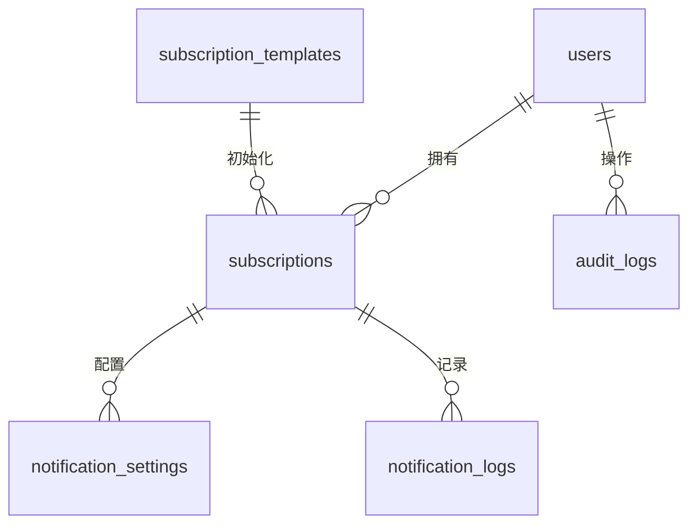

# 瓜的订阅管理 · 服务端设计与施工方案

## 1. 项目概述

- **目标**：以 NestJS + MySQL + Drizzle ORM 为核心，构建一个高可靠、易扩展的订阅管理服务端，满足订阅项管理、提醒通知和数据统计等需求，并与微信小程序客户端联通。
- **范围**：涵盖身份认证、订阅 CRUD、提醒推送、统计分析、模板管理、系统配置与监控等功能模块，支持后续家庭共享和自动识别等扩展能力。

## 2. 技术选型与整体架构

- **框架**：NestJS（REST API，模块化＋依赖注入）。
- **数据库**：MySQL 8（主从 + 读写分离预留），Drizzle ORM 负责数据访问和迁移（SQL-first）。
- **缓存与任务**：Redis 用于会话缓存、速率限制、调度辅助。
- **消息推送**：调用微信订阅消息 API，按用户提醒配置发送。
- **部署形态**：容器化（Kubernetes 或 Serverless）+ GitHub Actions CI/CD；配置中心与密钥管理使用 Vault/SSM。
- **架构分层**：Controller → Service（领域逻辑） → Repository（Drizzle） → Database；横切关注点（鉴权、日志、异常、校验、中间件）统一管理。

## 3. 模块设计

### 3.1 基础模块

- `AppModule`：应用入口，注册全局配置、日志、异常过滤器和拦截器。
- `ConfigModule`：封装环境变量加载、配置校验、服务端常量。
- `LoggingModule`：基于 `pino` 输出 JSON 日志，接入集中日志平台。

### 3.2 认证与用户模块 (`AuthModule`, `UsersModule`)

- 接入微信登录：客户端传入 `code`，Server 通过政府平台接口换取 `openid`/`unionid`。
- 用户表 `users` 保存基础信息；若存在 `union_id`，支持多端账户合并。
- JWT + Refresh Token：Access Token 用于接口鉴权，Refresh Token 刷新会话，Redis 黑名单确保登出。
- 全局守卫：`AuthGuard` 验证 Bearer Token，`RateLimitGuard` 控制速率。

### 3.3 订阅管理模块 (`SubscriptionsModule`)

- 功能：模板导入、新增/编辑/归档/删除、标签与搜索、批量操作。
- 业务规则：维护订阅状态（`active`、`archived`）、自动计算下一次到期日、支持自定义周期。
- 文件上传：Logo 等资源转存对象存储（COS/OSS），返回 CDN URL。
- Drizzle Repository：封装常用查询（按到期排序、按分类聚合）。

### 3.4 提醒配置与推送 (`NotificationModule`, `SchedulerModule`)

- `notification_settings` 记录每个订阅的提醒设置（提前 N 天、多渠道）。
- 定时扫描：Cron Job 每小时拉取即将到期订阅（Redis Sorted Set 缓存即将发送列表）。
- 发送机制：调用微信订阅消息 API，失败重试（指数退避、最多 3 次），记录 `notification_logs`。
- 前端显示：提供“今日提醒”列表接口，客户端按需展示红点提醒。

### 3.5 数据统计模块 (`StatsModule`)

- 聚合查询月度/年度支出、即将到期数量、归档数量。
- 采用 Drizzle SQL builder 或原生 SQL 聚合；高频接口配合 Redis 缓存（TTL 5min）。
- 预留物化视图/批处理机制以应对未来大数据量。

### 3.6 系统支撑模块

- `TemplatesModule`：维护订阅模板库，支持后台运营更新。
- `AuditModule`（可选）：Repository 层钩子记录 CRUD 前后差异，写入 `audit_logs`。
- `AdminModule`（可选）：提供内部配置界面，管理模板、通知策略。

## 4. 数据库设计

### 4.1 表结构草案

- `users(id, open_id, union_id, phone, created_at, updated_at, last_login_at)`
- `subscriptions(id, user_id, name, logo_url, price, currency, cycle, custom_cycle_days, next_due_date, category, notes, status, payment_method, created_at, updated_at)`
- `notification_settings(id, subscription_id, advance_days, channel, active, last_sent_at, created_at, updated_at)`
- `notification_logs(id, subscription_id, channel, status, response, sent_at, created_at)`
- `subscription_templates(id, name, logo_url, default_price, currency, cycle, category, description, created_at, updated_at)`
- `audit_logs(id, user_id, entity, entity_id, action, before, after, created_at)`

### 4.2 数据一致性策略

- 使用 Drizzle + MySQL Transaction 保证订阅及提醒配置的原子写入。
- 重要字段（价格、周期）更新需记录审计日志。
- 定期备份（每日全量、小时增量），并启用数据脱敏副本用于 BI。

## 5. 接口设计

- **规范**：REST；公共前缀 `/api/v1`；所有业务接口需携带 Authorization Header。
- **验证**：DTO 配合 `class-validator`；使用全局异常过滤器返回统一错误格式 `{ code, message, trace_id }`。
- **主要接口**：
  - `POST /auth/login`：微信登录，返回 `access_token` 与 `refresh_token`。
  - `POST /auth/refresh` / `POST /auth/logout`。
  - `GET /subscriptions`：支持分页、按状态/分类/关键字过滤、按到期/金额排序。
  - `POST /subscriptions` / `PATCH /subscriptions/:id` / `DELETE /subscriptions/:id`（软删除或归档）。
  - `POST /subscriptions/:id/reminders`、`PATCH /subscriptions/:id/reminders/:sid`。
  - `GET /stats/summary`、`GET /stats/trend`（传入时间范围）。
  - `GET /templates`：列出可用模板，支持一键导入 `POST /templates/:id/import`。
- 提供 Swagger/OpenAPI 文档，方便前后端联调。

## 6. 定时任务与消息推送

- 使用 `@nestjs/schedule` 注册 Cron 任务：`0 * * * *` 每小时扫描一次。
- 查询条件：`next_due_date BETWEEN now AND now + advance_days` 且 `notification_settings.active = true`。
- 结果写入 Redis Sorted Set，按发送时间排序，短期内重复执行时可去重。
- 任务执行时调用微信接口，如失败写日志并推送告警，超出重试次数后标记失败等待人工处理。
- 每月支出汇总推送：Cron 任务在每月末执行，按照用户配置决定是否发送。

## 7. 安全与合规

- 全站启用 HTTPS；敏感配置通过环境变量注入，使用 Secrets Manager 存储。
- 授权与权限控制：JWT 权限校验 + 数据层过滤，所有查询按 `user_id` 隔离。
- 速率限制：`@nestjs/throttler` 控制 60 req/min，超限返回 429。
- 日志脱敏：对 open_id、手机号等字段做脱敏或 Hash 处理。
- 数据合规：数据留存于国内 IDC；提供数据导出与删除能力以满足用户隐私需求。

## 8. 部署与环境规划

- **环境**：本地开发、测试、预发布、生产；数据库与 Redis 分环境隔离。
- **容器镜像**：使用多阶段 Dockerfile（Node 18 + Alpine），CI 编译并推送到镜像仓库。
- **配置**：通过 Helm 或 Serverless 配置环境变量、Secrets、资源限制。
- **伸缩**：HPA 根据 CPU/请求延迟自动扩缩容；定时任务单独部署 Worker 实例避免互斥。
- **备份与恢复**：MySQL 定期快照，Redis 持久化 RDB + AOF；演练容灾流程。

## 9. 开发与实施计划

| 阶段               | 时间          | 关键产出                                        |
| ------------------ | ------------- | ----------------------------------------------- |
| 阶段 0：准备       | T0 ~ T0+1w    | 确认需求、搭建脚手架、落地技术规范、CI baseline |
| 阶段 1：基础能力   | T0+1w ~ T0+3w | 完成 Auth、用户、订阅 CRUD、模板导入、Swagger   |
| 阶段 2：提醒系统   | T0+3w ~ T0+5w | 定时任务、提醒配置、微信推送、日志与重试        |
| 阶段 3：统计分析   | T0+5w ~ T0+6w | 汇总统计接口、缓存策略、性能优化                |
| 阶段 4：非功能完善 | T0+6w ~ T0+7w | 审计、监控、异常告警、安全策略、压测            |
| 阶段 5：联调发布   | T0+7w ~ T0+8w | 前后端联调、测试验收、编写运维手册、上线        |

## 10. 测试与质量保障

- 单元测试：Jest 覆盖 Service 逻辑，目标覆盖率 80%+。
- 集成测试：Supertest + Drizzle fixtures/seed 数据，验证 API 与数据库交互。
- 合同测试：与小程序端对齐接口契约，自动化校验请求/响应格式。
- 定时任务模拟：使用 Mock Clock/测试任务队列验证提醒流程。
- 代码质量：ESLint、Prettier、Commitlint；Pre-push 钩子执行单测和 Lint。

## 11. 运维与监控

- 指标监控：Prometheus + Grafana 监控请求量、延迟、错误率、任务执行成功率。
- 日志采集：集中式 ELK/ClickHouse；关键操作标注 traceId 以便追踪。
- 告警策略：接口错误率、推送失败率、数据库延迟等触发企业微信/钉钉告警。
- 版本管理：GitFlow 或 trunk-based；发布前执行 Canary 验证。
